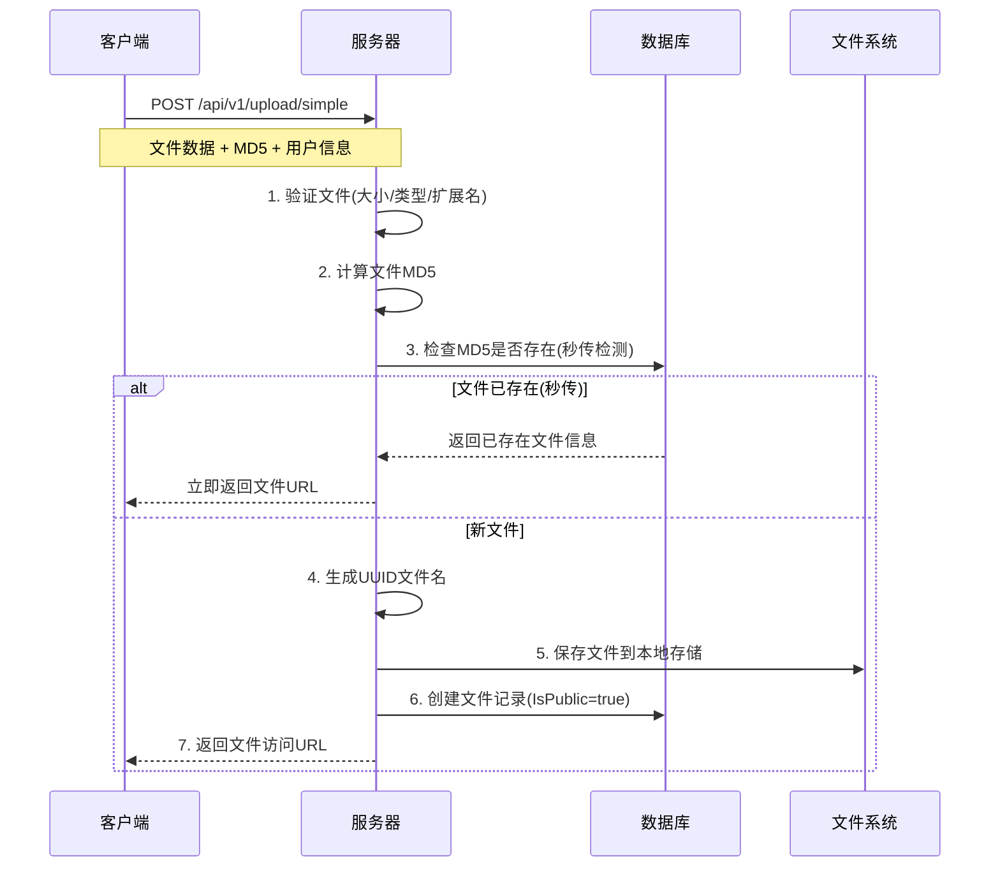
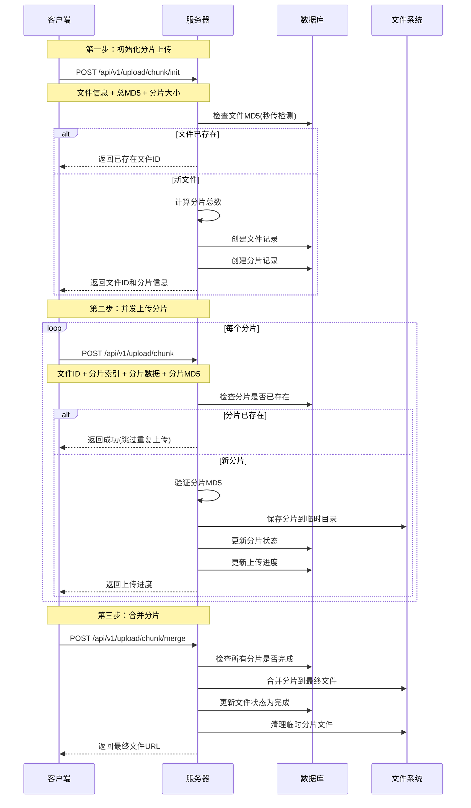
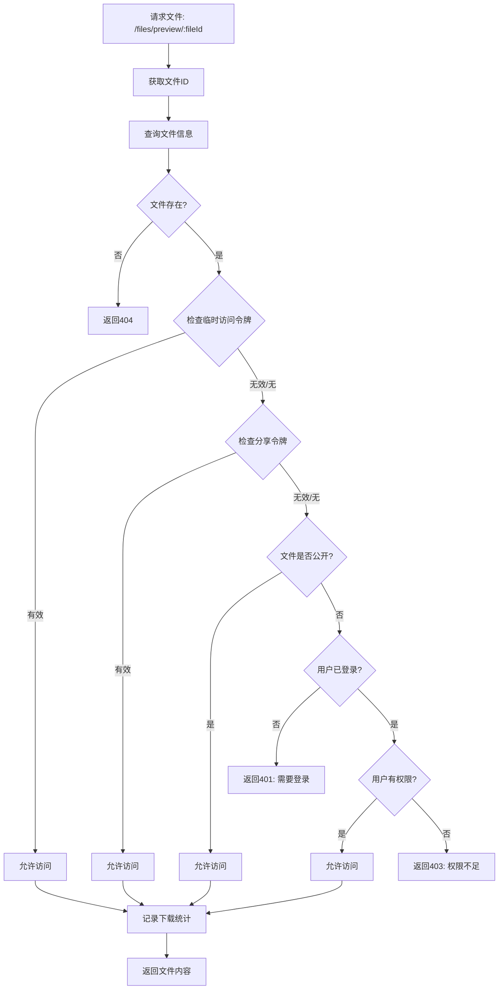

# 📁 Upload模块完整流程总结

## 🔄 上传流程

### **1. 简单上传流程 (文件 ≤ 2MB)**



**返回的URL格式**：`/files/preview/{fileId}/{filename.ext}`

### **2. 分片上传流程 (文件 > 2MB)**



## 🔗 URL生成流程

### **URL格式演变**

```typescript
// 旧格式 (仅UUID)
"/files/preview/67afd764-1e0b-4a54-a181-7b66fad62309"

// 新格式 (UUID + 文件名)
"/files/preview/67afd764-1e0b-4a54-a181-7b66fad62309/image.jpg"
```

### **URL生成逻辑**

```go
// 在 SimpleUpload 和 MergeChunks 中
FilePath: fmt.Sprintf("/files/preview/%s/%s", uploadFile.ID.String(), uploadFile.Filename)
```

**优势**：
- ✅ 保持UUID的唯一性和安全性
- ✅ URL中包含文件扩展名，便于识别文件类型
- ✅ 支持原始文件名显示
- ✅ 向后兼容，同时支持两种路由格式

## 🔐 文件权限控制流程

### **权限验证中间件流程**



### **权限层级 (优先级从高到低)**

1. **临时访问令牌** - 系统生成的临时链接
2. **分享令牌** - 用户创建的分享链接  
3. **公开文件** - 任何人都可访问
4. **私有文件权限** - 需要用户登录并验证权限

### **文件访问权限类型**

| 文件状态 | 访问条件 | 说明 |
|---------|---------|------|
| **公开文件** | 无需验证 | `IsPublic = true`，任何人可访问 |
| **私有文件** | 需要权限 | `IsPublic = false`，需要登录且有权限 |
| **分享文件** | 分享令牌 | 通过分享链接访问，可设置密码和有效期 |
| **临时访问** | 临时令牌 | 系统生成的临时访问，有使用次数和时间限制 |

## 💾 数据库模型关系

### **核心表结构**

```sql
-- 主文件表
upload_file {
    id: UUID (主键)
    filename: STRING (原始文件名)
    stored_name: STRING (UUID存储名)
    file_path: STRING (文件路径)
    file_size: INT64 (文件大小)
    mime_type: STRING (MIME类型)
    extension: STRING (文件扩展名)
    md5_hash: STRING (文件MD5，用于秒传)
    is_public: BOOLEAN (是否公开，默认true)
    download_count: INT (下载次数统计)
    user_id: STRING (上传者ID)
    upload_status: INT (上传状态)
    uploaded_at: TIMESTAMP (上传完成时间)
}

-- 分片信息表
chunk_info {
    id: UUID (主键)
    file_id: STRING (文件ID，外键)
    chunk_index: INT (分片索引)
    chunk_size: INT64 (分片大小)
    chunk_path: STRING (分片路径)
    md5_hash: STRING (分片MD5)
    is_uploaded: BOOLEAN (是否已上传)
}

-- 文件分享表
file_share {
    id: UUID (主键)
    file_id: STRING (文件ID，外键)
    share_token: STRING (分享令牌，唯一)
    share_name: STRING (分享名称)
    expires_at: TIMESTAMP (过期时间)
    access_password: STRING (访问密码)
    download_limit: INT (下载次数限制)
    download_count: INT (已下载次数)
    created_by: STRING (创建者ID)
    is_active: BOOLEAN (是否激活)
}

-- 文件权限表
file_permission {
    id: UUID (主键)
    file_id: STRING (文件ID，外键)
    user_id: STRING (用户ID，外键)
    permission: STRING (权限类型: read/download/manage)
    granted_by: STRING (授权者ID)
    expires_at: TIMESTAMP (权限过期时间)
    is_active: BOOLEAN (是否激活)
}

-- 临时访问表
temporary_access {
    id: UUID (主键)
    file_id: STRING (文件ID，外键)
    access_token: STRING (访问令牌，唯一)
    purpose: STRING (用途说明)
    expires_at: TIMESTAMP (过期时间，必须)
    usage_limit: INT (使用次数限制)
    usage_count: INT (已使用次数)
    created_by: STRING (创建者)
    is_active: BOOLEAN (是否激活)
}
```

## 🚀 技术特性

### **已实现功能**

✅ **双模式上传**：简单上传 + 分片上传  
✅ **秒传检测**：基于MD5哈希避免重复上传  
✅ **断点续传**：支持暂停和恢复上传  
✅ **进度跟踪**：实时显示上传进度  
✅ **文件去重**：相同文件只存储一份  
✅ **权限控制**：多层级权限验证  
✅ **安全存储**：UUID文件名防止遍历攻击  
✅ **统计功能**：下载次数和访问记录  

### **文件存储策略**

- **存储路径**：`./uploads/` (最终文件)
- **临时路径**：`./uploads/tmp/` (分片临时存储)
- **命名规则**：`{UUID}.{原始扩展名}`
- **访问方式**：通过文件ID而非直接路径访问

### **安全特性**

🔒 **访问控制**：基于权限的文件访问  
🔒 **令牌验证**：分享和临时访问令牌  
🔒 **文件验证**：MIME类型和扩展名验证  
🔒 **MD5校验**：确保文件完整性  
🔒 **路径隔离**：UUID防止路径遍历  

## 🎯 使用示例

### **前端上传代码**

```typescript
// 使用全局文件上传组件
<GlobalFileUpload 
  :multiple="true"
  :auto-upload="true"
  @success="handleUploadSuccess"
  @error="handleUploadError"
/>

// 处理上传成功
const handleUploadSuccess = (response: any) => {
  console.log('文件URL:', response.filePath)
  // 输出: /files/preview/uuid/filename.jpg
}
```

### **后端文件访问**

```bash
# 直接访问公开文件
GET /files/preview/67afd764-1e0b-4a54-a181-7b66fad62309/image.jpg

# 带分享令牌访问
GET /files/preview/67afd764-1e0b-4a54-a181-7b66fad62309/image.jpg?share_token=abc123

# 下载文件
GET /files/download/67afd764-1e0b-4a54-a181-7b66fad62309/image.jpg
```

---

**总结**：Upload模块提供了完整的文件上传、存储、访问控制解决方案，支持多种上传模式和灵活的权限管理，确保文件的安全性和可访问性。 